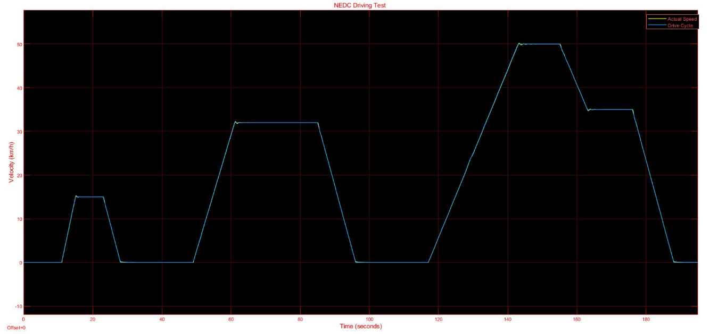
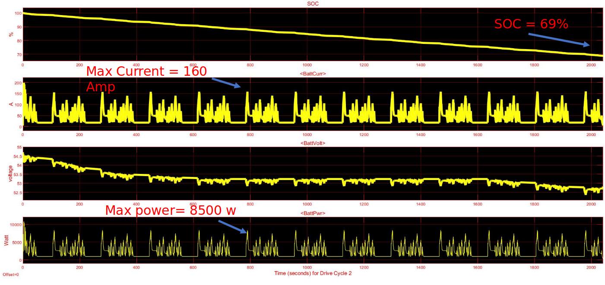
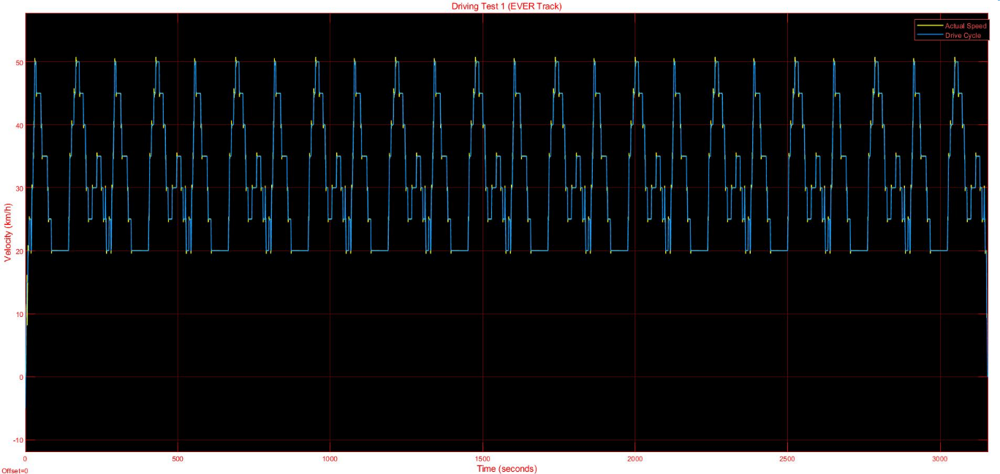
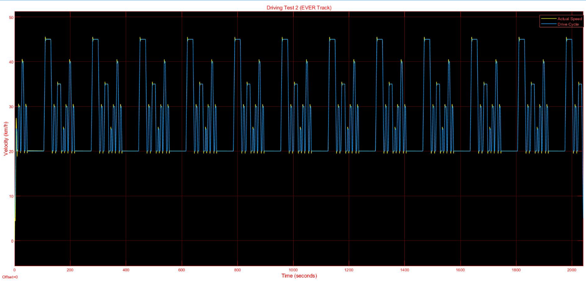

# CAR PERFORMANCE ANALYSIS USING SIMULINK (EVER 2020)
This project contains simulink implementation of car performance analysis using Simulink. As a participant of Electric Vehicle Rally (EVER 2020), I designed different drive cycles for the car to fit the competition track while maintaining high efficiency and fast speed. Battery and motor specifictions, vehicle dynamics and controller tuning are taken into account to provide an accurate model for the real vehicle performance.

## Overview
In order to calculate the powertrain performance, power distribution and power management in the car, a Simulink model was built to monitor the car performance with two different drive cycles made specifically for the EVER track.To make sure that the cat model follows precisely the given drive cycle, PI controller was tuned to make the model more accurate. 

The drive cycle test was implemented with car parameters. (Frontal Area = 1.4 𝑚2, air density=1.255 𝑘𝑔/𝑚3, drag coefficient= 0.38 (using ANSYS), car mass (with driver) =365kg, tire pressure=2.5 bar, tire radius=0.3 m).

In addition, battery performance was calculated in terms of state of charge (SOC), Current withdrawn, and Power consumption as shown in the results section. It was seen that there is an early peak in both current and power due to the high torque needed to overcome car inertia. Since the battery voltage is almost constant, the current and power have the same output graph but with different scales.

## Results
As a base case, New European Drive Cycle (NEDC) was tested on the car and the performance results were as follows:

 

In addition, the two custom drive cycles for the EVER track were as follow:

Since two different drive cycles with different speed profiles were implemented, the key differences are summarized in this table:

| Analysis/Drive cycle           | Drive cycle 1     | Drive cycle 2     |
| ----------------------- |:--------   |:-----------|
| SOC used                |   57%      | 31%        |
| Time (s)                |   3158     | 2041       |
| Max speed               |   50       |     45     |

As indicated in the table, drive cycle 2 resulted in better performance and thus was chosed for the competition.

Also, the steady state response from 0 to 150 km/h:

## Acknowledgement
This project was part of my contribution as an electric system head in the team representing Nile University in [EVER](https://electricvehiclerally.org/) 2020. 

## References
* https://www.mathworks.com/videos/matlab-and-simulink-racing-lounge-vehicle-modeling-part-1-simulink-1502466996305.html